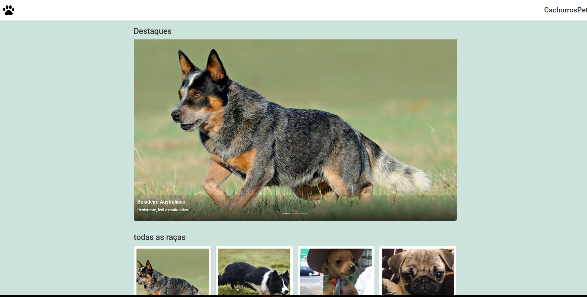

deus é bom,

Christiano Gonçalves
matricula 900008

teve mais js pq se nao eu ia ter que fazer 9 paginas html, ai eu to puland fora disso.

as cores nao estao bacanas ainda, queria ter colocado uma paleta melhor, mas ne outra semana eu posso ver isso,

a fonte eu peguei na internet mesmo, acho a arial basica demais, ai so copiei e coloquei do google fontes.